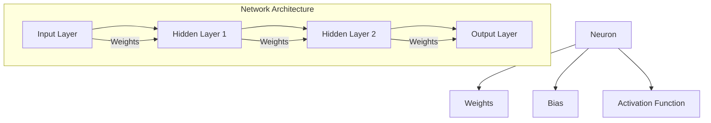

# THE PLAN

## Data Preparation
- [x] Understanding the MNIST dataset structure
- [x] Loading and normalizing the data
- [x] Splitting into training and test sets

## Network Architecture
- [ ] Input layer (784 neurons for 28x28 images)
- [ ] Hidden layer(s)
- [ ] Output layer (10 neurons for digits 0-9)

## Activation Functions
- [ ] Sigmoid: f(x) = 1 / (1 + e^(-x))
- [ ] ReLU: f(x) = max(0, x)
- [ ] Tanh: f(x) = (e^x - e^(-x)) / (e^x + e^(-x))
- [ ] Softmax for output layer: f(x_i) = e^(x_i) / Σ(e^(x_j))

## Forward Propagation
- [ ] Matrix multiplication and bias addition
- [ ] Applying activation functions

## Loss Function
- [ ] Cross-entropy loss for classification

## Backpropagation
- [ ] Computing gradients using the chain rule
- [ ] Updating weights and biases

## Optimization
- [ ] Stochastic Gradient Descent (SGD)
- [ ] Learning rate and mini-batch size

## Training Loop
- [ ] Iterating through epochs and mini-batches

## Evaluation
- [ ] Accuracy calculation on test set

## Debugging and Optimization
- [ ] Techniques for identifying and fixing issues
- [ ] Strategies for improving performance

